# RealityKitFormats Scorecard

| Model | Source | Target | Thumbnail |
|-------|--------|--------|-----------|
| ABeautifulGame | GLB | DAE | 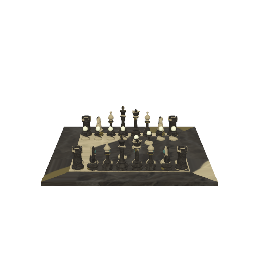 |
| ABeautifulGame | GLB | GLB | 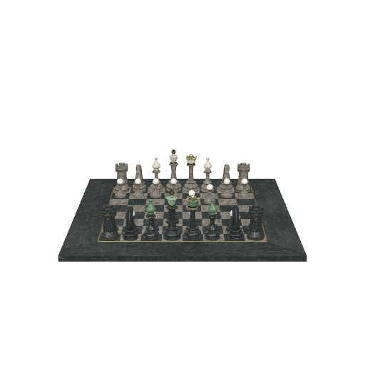 |
| ABeautifulGame | GLB | OBJ | 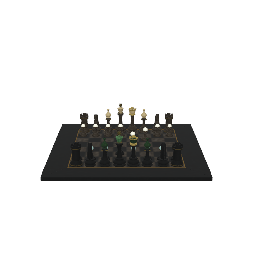 |
| ABeautifulGame | GLB | ORIGINAL | 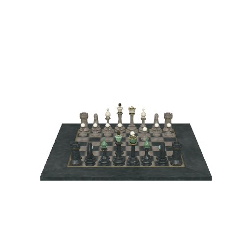 |
| ABeautifulGame | GLB | STL | 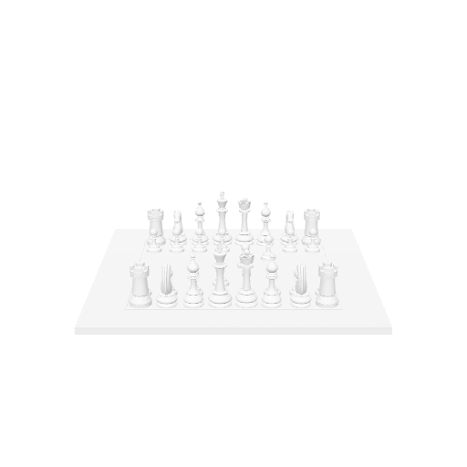 |
| ABeautifulGame | GLB | USDZ | 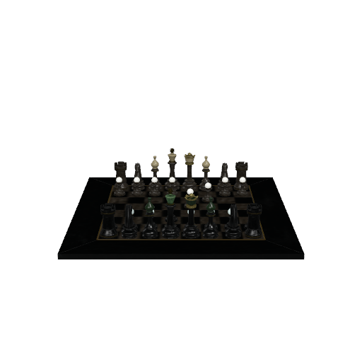 |
| CarConcept | GLB | DAE | 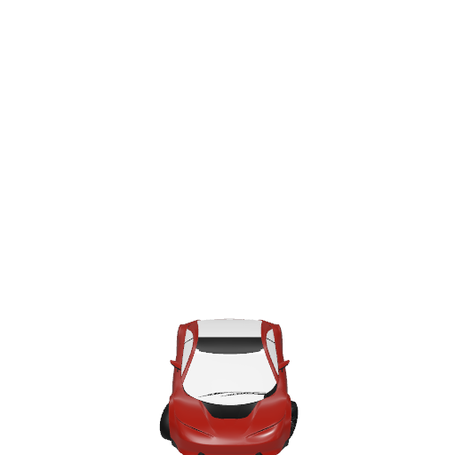 |
| CarConcept | GLB | GLB | 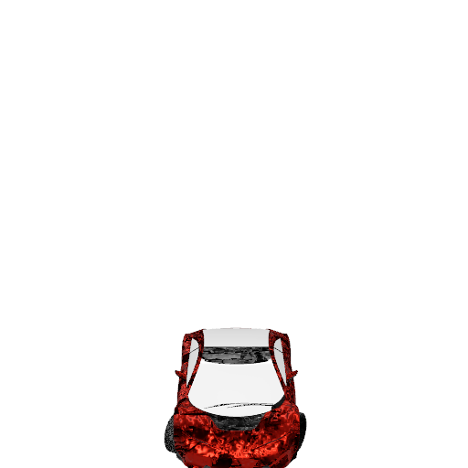 |
| CarConcept | GLB | OBJ | 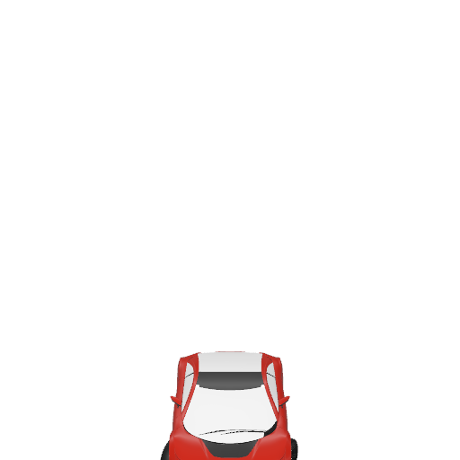 |
| CarConcept | GLB | ORIGINAL | 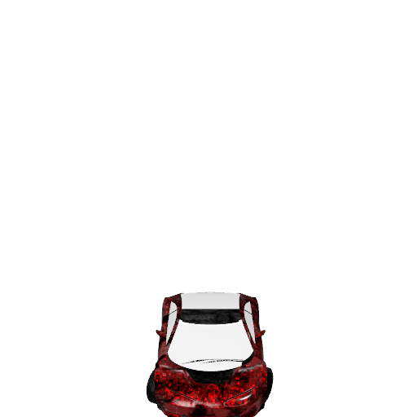 |
| CarConcept | GLB | STL | 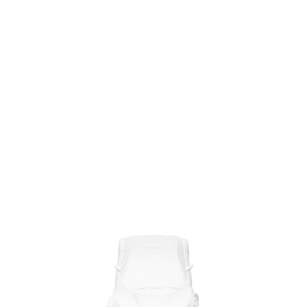 |
| CarConcept | GLB | USDZ | 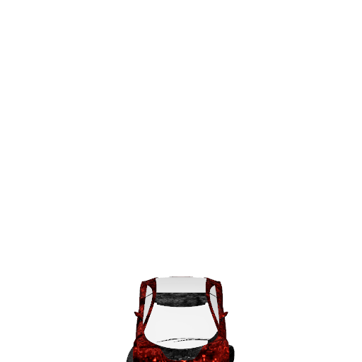 |
| ChronographWatch | GLB | DAE |  |
| ChronographWatch | GLB | GLB |  |
| ChronographWatch | GLB | OBJ |  |
| ChronographWatch | GLB | ORIGINAL |  |
| ChronographWatch | GLB | STL |  |
| ChronographWatch | GLB | USDZ |  |
| DamagedHelmet | GLB | DAE | 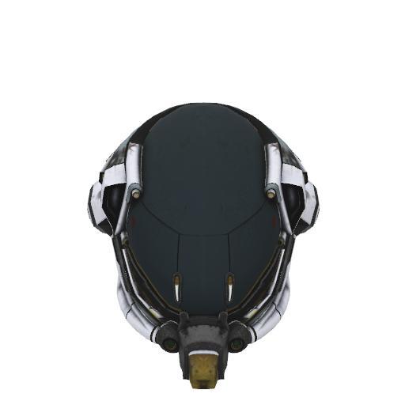 |
| DamagedHelmet | GLB | GLB |  |
| DamagedHelmet | GLB | OBJ | 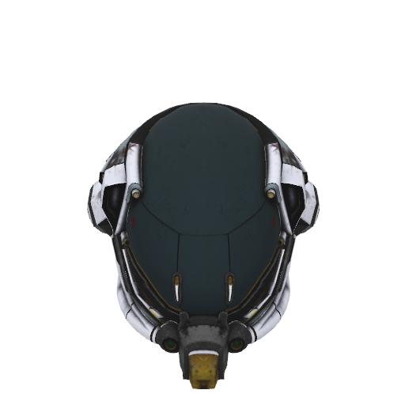 |
| DamagedHelmet | GLB | ORIGINAL | 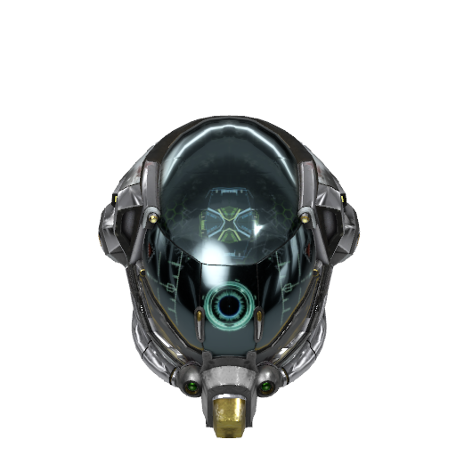 |
| DamagedHelmet | GLB | STL | 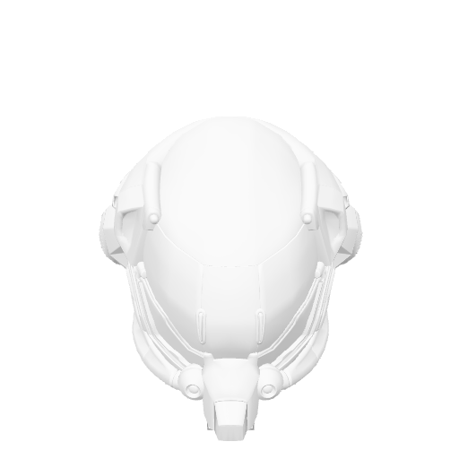 |
| DamagedHelmet | GLB | USDZ | 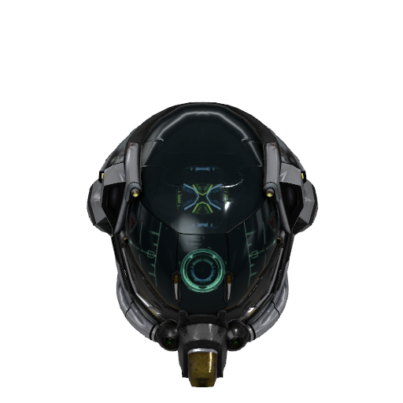 |
| Duck | DAE | DAE | 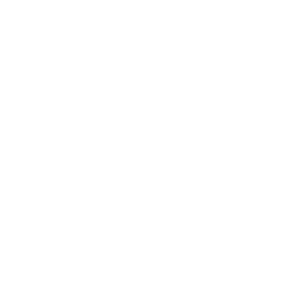 |
| Duck | DAE | GLB |  |
| Duck | DAE | OBJ |  |
| Duck | DAE | ORIGINAL | 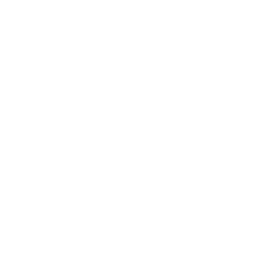 |
| Duck | DAE | STL |  |
| Duck | DAE | USDZ |  |
| GearboxAssy | DAE | DAE | 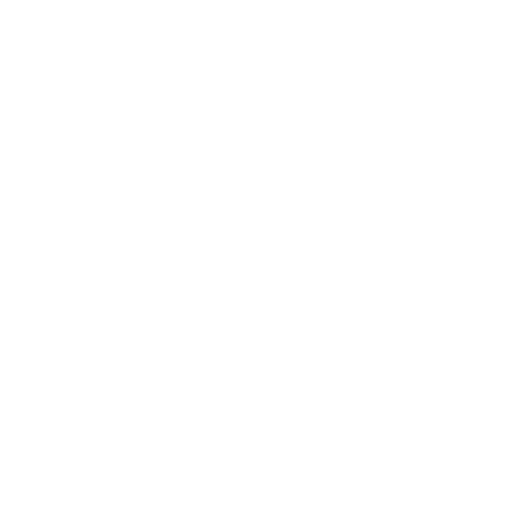 |
| GearboxAssy | DAE | GLB |  |
| GearboxAssy | DAE | OBJ |  |
| GearboxAssy | DAE | ORIGINAL |  |
| GearboxAssy | DAE | STL | 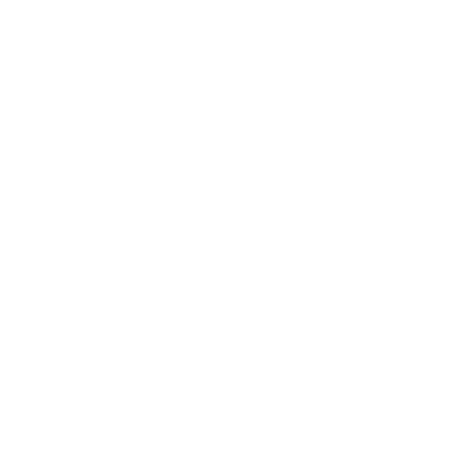 |
| GearboxAssy | DAE | USDZ |  |
| ToyCar | GLB | DAE | 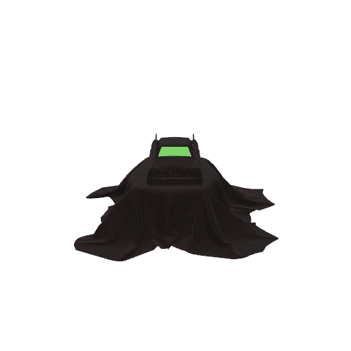 |
| ToyCar | GLB | GLB | 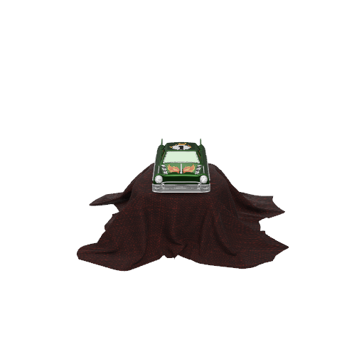 |
| ToyCar | GLB | OBJ | 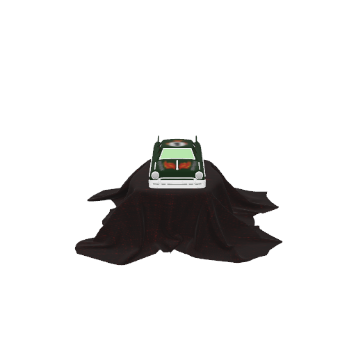 |
| ToyCar | GLB | ORIGINAL | 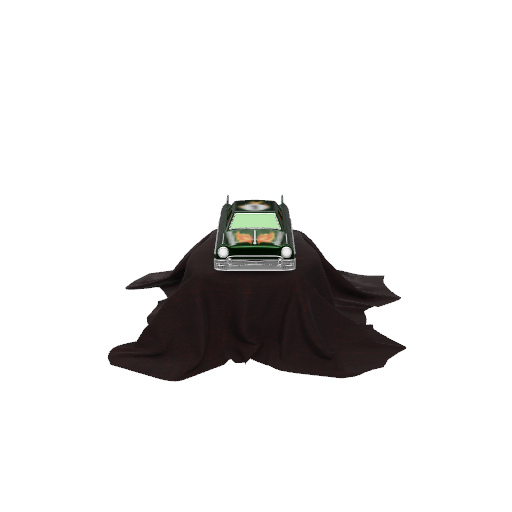 |
| ToyCar | GLB | STL | 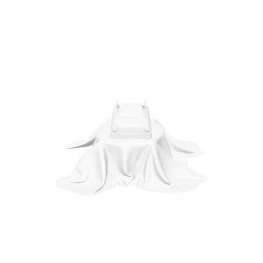 |
| ToyCar | GLB | USDZ | 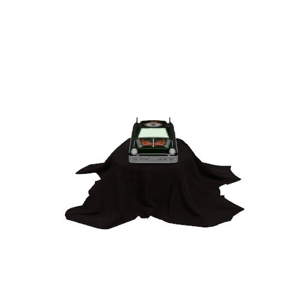 |
| teapot | USDZ | DAE | 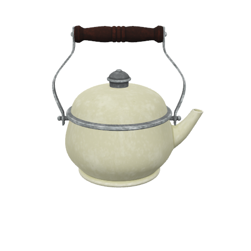 |
| teapot | USDZ | GLB |  |
| teapot | USDZ | OBJ |  |
| teapot | USDZ | ORIGINAL | 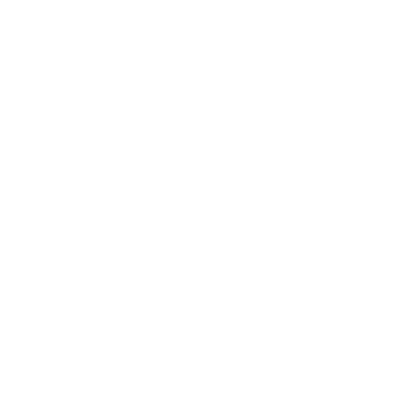 |
| teapot | USDZ | STL | 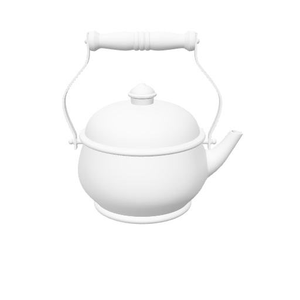 |
| teapot | USDZ | USDZ | 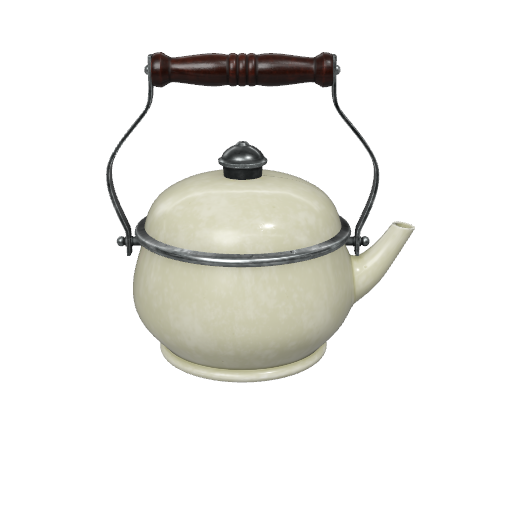 |
