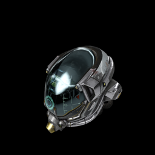
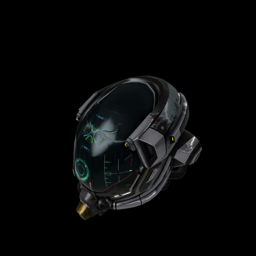
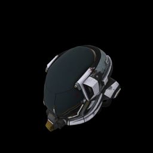
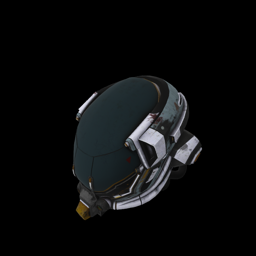
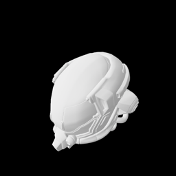
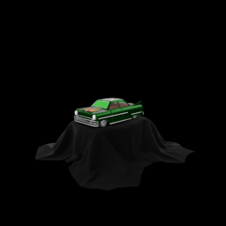
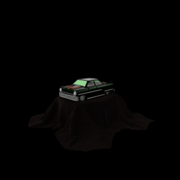
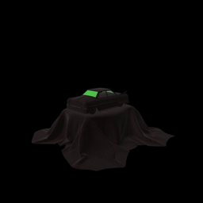
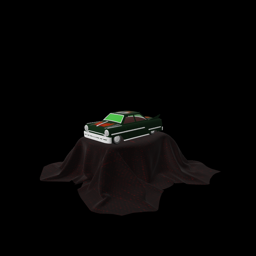
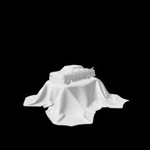

# RealityKitFormats Scorecard

Generated by `testGenerateScorecard()`. Each section shows round-trip conversion
results for one source model across all five target formats.

---
## DamagedHelmet.glb

| GLB (source) | USDZ | DAE | OBJ | STL |
|:---:|:---:|:---:|:---:|:---:|
|  |  |  |  |  |
| — | — | — | — | — |
| ✅ | ✅ | ✅ | ✅ | ✅ |

## ToyCar.glb

| GLB (source) | USDZ | DAE | OBJ | STL |
|:---:|:---:|:---:|:---:|:---:|
|  |  |  |  |  |
| — | — | — | — | — |
| ✅ | ✅ | ✅ | ✅ | ✅ |

---
_Last updated: 2026-06-11_
